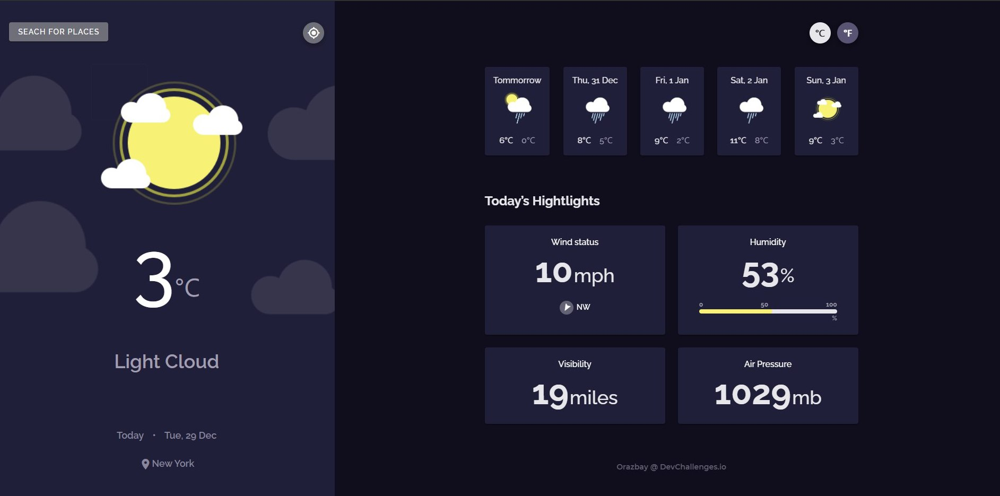

<!-- Please update value in the {}  -->

<h1 align="center">Weather app</h1>

<div align="center">
   Solution for a challenge from  <a href="http://devchallenges.io" target="_blank">Devchallenges.io</a>.
</div>

<div align="center">
  <h3>
    <a href="https://orazbay097.github.io/weather-app/">
      Demo
    </a>
    <span> | </span>
    <a href="https://devchallenges.io/solutions/UmToa6Dwl4mR2kFiiApC">
      Solution
    </a>
    <span> | </span>
    <a href="https://devchallenges.io/challenges/mM1UIenRhK808W8qmLWv">
      Challenge
    </a>
  </h3>
</div>

<!-- TABLE OF CONTENTS -->

## Table of Contents

- [Overview](#overview)
  - [Built With](#built-with)
- [Features](#features)
- [How to use](#how-to-use)
- [Contact](#contact)

<!-- OVERVIEW -->

## Overview



Simple appliction to get weather forecast.


### Built With

- [Vue.js](https://vuejs.org/)
- [Vuetify](https://vuetifyjs.com/)

## Features

<!-- List the features of your application or follow the template. Don't share the figma file here :) -->

This application/site was created as a submission to a [DevChallenges](https://devchallenges.io/challenges) challenge. The [challenge](https://devchallenges.io/challenges/mM1UIenRhK808W8qmLWv) was to build an application to complete the given user stories.
- I can see city weather as default, preferably my current location
- I can search for city
- I can see weather of today and the next 5 days
- I can see the date and location of the weather
- I can see according to image for each type of weather
- I can see the min and max degree each day
- I can see wind status and wind direction
- I can see humidity percentage
- I can see visibility indicator
- I can see air pressure number
- I can request my current location weather
- I can convert temperature in Celcius to Fahrenheit and vice versa

## How To Use

<!-- Example: -->

To clone and run this application, you'll need [Git](https://git-scm.com) and [Node.js](https://nodejs.org/en/download/) (which comes with [npm](http://npmjs.com)) installed on your computer. From your command line:

```bash
# Clone this repository
$ git clone https://github.com/orazbay097/weather-app

# Install dependencies
$ npm install

# Run the app
$ npm run serve
```

## Contact

- E-mail [orazbay.n.n@gmail.com](mailto:orazbay.n.n@gmail.com)
- GitHub [@orazbay097](https://github.com/orazbay097)
